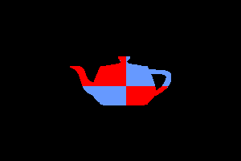

# VPU Model

The VPU project is a voxel-based graphics processor intended to run on an FPGA. This repository contains a C++ model of the hardware design intended for prototyping hardware architecture and algorithms quickly. Implemented features:

- Simple load/store style main core. Executes programs from memory and kicks dedicated hardware pipelines
- DMA pipeline
- Matrix pipeline based entirely on 12.4 fixed point maths
- Blitter (2D drawing) pipeline, including text rendering with hard-coded font
- Renderer (3D) pipeline (still in progress). Renders models and can apply transforms but has no direct support for rasterisation (assumes 1 voxel = 1 pixel) and has no built-in support for view/camera transforms

The program found [here](https://github.com/EdwardStables/VPU_ASM/blob/main/test_programs/rotate_model.asm) uses the matrix and renderer pipelines to render a spinning model, the following example showing the traditional teapot being rendered.

Before starting hardware implementation there are some features still to implement:
- More accurate memory simulation. Currently it has magical single cycle reads of up to 64 bytes, with no contention modeled between subsystems. My available FPGA has significantly less memory bandwidth.
- Performance modeling to give expected execution speeds
- Rendering improvements, including colour support, non-trivial rasterisation, camera transform, perspective transform.
- More accurate cycle count simulations. Currently it is overly optimisitic about execution time for matrix multiplications.

The project would also benefit from the following features, however they are unlikely to be done fully before hardware development starts:
- Compiler. The existing assembly language is challenging to write. A simple procedural programming language would help significantly.
- Interrupt support. This would be required for getting input from FPGA IO.
- Simulator performance. While the simulator does not need to be exceptionally fast it could be improved.

## Building

Build with `cmake`. Make sure the submodules are synced as building depends on the scripts there.

## Running

### Compiling Programs

See the README in the VPU\_ASM submodule for steps on writing and compiling programs.

### Running Simulator

See options with `vpu --help`. `vpu <binary program>` will execute the input binary. Note that the program _must_ be a compiled binary not a text program, it is loaded directly into memory and executed.

To see feedback from the execution you need to set some other options.

- `--trace` will print the register state each cycle
- `--pipeline` will print the instruction in each pipeline stage of the management core
- `--dump_mem/regs` will dump the entire memory state and end register state in files after completion. Note that the memory file is quite large
- `--step` will wait after executing each cycle, provide a number to step a specific number of cycles or just press enter to run one

## Tests

Pytest is used for simple tests, ensure pytest is installed and run tests with `pytest`. Running `pytest --no_clean` will leave the compiled objects in the `test/binaries` directory, which can be useful for testing.

